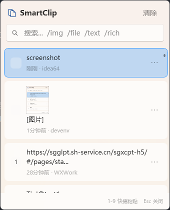

# SmartClip

智能剪贴板历史管理器，支持 Windows 10/11。



## 功能特性

- 📋 **剪贴板历史** - 自动保存最近 300 条记录，保留 30 天
- 🔍 **快速搜索** - 支持模糊搜索和类型过滤（`/img` `/file` `/text` `/rich`）
- 📌 **置顶功能** - 常用内容一键置顶，永不丢失
- 🖼️ **多格式支持** - 文本、富文本、图片、文件路径
- ⌨️ **快捷操作** - 数字键 1-9 快速粘贴
- 🎨 **Fluent Design** - 自动跟随 Windows 深色/浅色模式，Mica 材质背景
- 🪟 **系统级显示** - 可显示在开始菜单等系统界面之上（UIAccess）
- 🔔 **系统托盘** - 最小化到托盘，随时唤出
- 🚀 **开机自启** - 可选开机自动启动

## 安装

### 方式一：下载安装（推荐）

1. 从 [Releases](https://github.com/2929108180/SmartClip/releases) 下载最新版本的 `SmartClip-vX.X.X.zip`
2. 解压到任意目录
3. 右键点击 `Install.bat`，选择 **"以管理员身份运行"**
4. 按提示信任证书并完成安装

安装完成后会自动创建：
- 开始菜单快捷方式
- 桌面快捷方式
- 开机自启动项（可在托盘菜单关闭）

### 方式二：从源码编译

```powershell
# 克隆仓库
git clone https://github.com/2929108180/SmartClip.git
cd SmartClip

# 开发模式运行（无需签名）
cd SmartClip
dotnet run

# 发布模式（需要先生成证书）
cd Scripts
.\CreateCertificate.ps1  # 生成自签名证书
.\CreateRelease.ps1      # 编译、签名、打包
```

### 卸载

右键点击安装目录中的 `Uninstall.bat`，选择"以管理员身份运行"。

将自动移除：程序文件、桌面快捷方式、开始菜单项、开机自启动项。

## 使用方法

### 快捷键

| 快捷键 | 功能 |
|--------|------|
| `Win+V` | 唤出/隐藏剪贴板 |
| `Enter` | 粘贴选中项 |
| `Shift+Enter` | 粘贴为纯文本 |
| `1-9` | 快速粘贴对应项 |
| `↑/↓` | 上下选择 |
| `Esc` | 关闭窗口 |
| `Ctrl+P` | 置顶/取消置顶 |
| `Delete` | 删除选中项 |

### 搜索过滤

在搜索框输入以下命令可过滤类型：

| 命令 | 说明 |
|------|------|
| `/img` | 只显示图片 |
| `/file` | 只显示文件 |
| `/text` | 只显示纯文本 |
| `/rich` | 只显示富文本 |

也可以组合使用：`/img 截图` 搜索包含"截图"的图片记录。

### 托盘菜单

右键点击系统托盘图标：
- **打开 SmartClip** - 显示主窗口
- **开机自启动** - 切换开机启动
- **退出** - 完全退出程序

## 项目结构

```
SmartClip/
├── SmartClip/                  # 主项目
│   ├── Models/                 # 数据模型
│   │   └── ClipboardItem.cs    # 剪贴板项模型
│   ├── Services/               # 业务服务
│   │   ├── ClipboardService.cs      # 剪贴板监听
│   │   ├── StorageService.cs        # 数据持久化
│   │   ├── HotkeyService.cs         # 全局热键
│   │   ├── PasteSimulatorService.cs # 粘贴模拟
│   │   ├── TrayService.cs           # 系统托盘
│   │   └── WindowPositionService.cs # 窗口定位
│   ├── ViewModels/             # MVVM 视图模型
│   ├── Views/                  # UI 视图
│   │   └── ConfirmDialog.xaml  # 确认对话框
│   ├── MainWindow.xaml         # 主窗口
│   ├── app.manifest            # UIAccess 版本清单
│   └── app.manifest.dev        # 开发版本清单
├── Scripts/                    # 构建和安装脚本
│   ├── CreateCertificate.ps1   # 生成自签名证书
│   ├── CreateRelease.ps1       # 打包发布版本
│   ├── SignAndPublish.ps1      # 签名并发布
│   ├── Install.ps1             # 用户安装脚本
│   ├── Install.bat             # 安装启动器
│   └── Uninstall.bat           # 卸载脚本
├── Certificates/               # 证书目录（不提交到 Git）
└── docs/                       # 文档和截图
```

## 技术栈

- **.NET 9.0** - 最新 LTS 版本
- **WPF** - Windows Presentation Foundation
- **WPF-UI 4.1.0** - Fluent Design 组件库
- **Win32 API** - 热键钩子、剪贴板监听、窗口管理

## 为什么需要安装证书？

SmartClip 使用 Windows **UIAccess** 权限，可以显示在开始菜单、任务视图等系统界面之上。这是 Windows 安全机制的要求：

1. 应用必须使用受信任的证书签名
2. 应用必须安装在受保护目录（如 Program Files）

自签名证书仅用于代码签名，安装到"受信任的根证书颁发机构"后即可正常使用。证书不会影响系统其他功能。

## 数据存储

剪贴板历史保存在：
```
%LocalAppData%\SmartClip\
├── clipboard.json    # 剪贴板记录
└── images\           # 图片缓存
```

## 开发

### 环境要求

- Windows 10/11
- .NET 9.0 SDK
- Visual Studio 2022 或 VS Code

### 调试运行

```powershell
cd SmartClip
dotnet run
```

开发模式使用 `app.manifest.dev`，不需要 UIAccess 权限和签名。

### 构建发布

```powershell
cd Scripts
.\CreateRelease.bat
```

## 许可证

[MIT License](LICENSE)

## 贡献

欢迎提交 Issue 和 Pull Request！

### 贡献指南

1. Fork 本仓库
2. 创建特性分支 (`git checkout -b feature/AmazingFeature`)
3. 提交更改 (`git commit -m 'Add some AmazingFeature'`)
4. 推送到分支 (`git push origin feature/AmazingFeature`)
5. 提交 Pull Request

## 致谢

- [WPF-UI](https://github.com/lepoco/wpfui) - Fluent Design 组件库
- [Segoe MDL2 Assets](https://docs.microsoft.com/en-us/windows/apps/design/style/segoe-ui-symbol-font) - 图标字体
